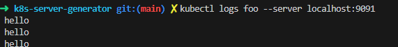

# Kubernetes Mock Server Generator

A tool that generates a TypeScript-based mock Kubernetes API server from an OpenAPI specification. This mock server can be used for testing Kubernetes clients without requiring a real Kubernetes cluster.

## Features

- **OpenAPI-based**: Generate a mock server from a Kubernetes OpenAPI specification
- **Multiple storage backends**: In-memory, file-based, or Firestore storage
- **Authentication support**: Token-based authentication
- **Configurable logging**: Console, Winston, or Firebase logging
- **Customizable initial state**: Start with default resources or your own custom resources
- **Watch support**: Simulates Kubernetes watch endpoints
- **Log Streaming**: Log reading is enabled, and a special endpoint post /resource/logs allows for a streaming input
- **Subresource support**: Status, scale, and other subresources
- **Proto Support**: Supports Protos if fetchProtos in the config is true. If fetching protos the routine will expect an env var GITHUB_ACCESS_TOKEN. If not using protos calls like kubectl create will not work as they only send via protobuf

## Configuration

In lieue of amazinng docs, see the config.example.yaml for a solid starting point. 

## Installation

### Prerequisites

- Go 1.16+
- Node.js 14+
- npm or yarn

### Building from Source

```bash
# Clone the repository
git clone https://github.com/patricksimonian/k8s-mock-server-generator.git
cd k8s-mock-server-generator
go mody tidy
go run main.go -config config.yaml

# Generate a mock server
./k8s-mock-gen -config config.yaml


```

## Custom Features

Log streaming was added so that a user could 'emulate log streams'. The server generator generates a post /logs endpoint for Pods at a custom api k8s.emulator.v1.core (a place for future custom endpoints). Usage below:

```
 curl  --data-binary @<(printf '{"stdout":"hello"}\n') \
  -H "Content-Type: application/json" \
  http://localhost:9091/k8s.emulator.v1.core/namespaces/default/pods/foo/logs
```


